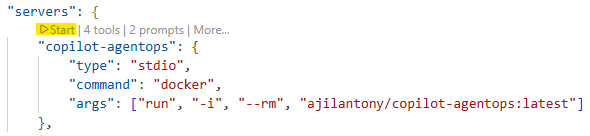
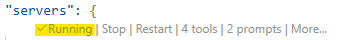

# Copilot AgentOps

Copilot AgentOps is a curated collection of frameworks and accelerators that brings together GitHub Copilot's official best practices, community-contributed artifacts, and proven patterns to maximize productivity when using GitHub Copilot.

This repository provides a comprehensive toolkit for enhancing GitHub Copilot with specialized:

- **[Agents](docs/README.agents.md)** - Specialized GitHub Copilot agents that integrate with MCP servers to provide enhanced capabilities for specific workflows and tools
- **[Prompts](docs/README.prompts.md)** - Focused, task-specific prompts for generating code, documentation, and solving specific problems
- **[Instructions](docs/README.instructions.md)** - Comprehensive coding standards and best practices that apply to specific file patterns or entire projects
- **[Hooks](docs/README.hooks.md)** - Automated workflows triggered by specific events during development, testing, and deployment
- **[Skills](docs/README.skills.md)** - Self-contained folders with instructions and bundled resources that enhance AI capabilities for specialized tasks
- **[Collections](docs/README.collections.md)** - Curated collections of related prompts, instructions, agents, and skills organized around specific themes and workflows
- **[Cookbook Recipes](cookbook/README.md)** - Practical, copy-paste-ready code snippets and real-world examples for working with GitHub Copilot tools and features

## How to Install Customizations

To make it easy to add these customizations to your editor, Copilot AgentOps is also available as an MCP (Model Context Protocol) server, making it easy to integrate into your development environment. This allows you to enable searching and installing prompts, instructions, agents, and skills directly from this repository. You'll need to have Docker installed and running to run the MCP server locally.

### Step 1: Open your Copilot settings in VS Code

In VS Code, open the Command Palette:

- **macOS**: `Cmd + Shift + P`
- **Windows/Linux**: `Ctrl + Shift + P`

Search for and select: **MCP: Open User Configuration**

This opens your MCP configuration file located at:

- **Windows**: `%USERPROFILE%\AppData\Roaming\Code\User\mcp.json`
- **macOS/Linux**: `~/.config/Code/User/mcp.json`

### Step 2: Locate the MCP servers configuration

In the mcp.json file, find or create the top‑level "servers" object.

### Step 3: Add the copilot-agentops MCP server

Add the following configuration block inside the `"servers"` object:

```json
{
  "servers": {
      "copilot-agentops": {
          "command": "docker",
          "args": ["run", "-i", "--rm", "ajilantony/copilot-agentops:latest"]
      }  
  }
}
```

### Step 4: Start the copilot-agentops MCP server

Click **Start** to pull the `copilot-agentops` Docker image from Docker Hub and launch the MCP server as a container on your local machine.



You will see that the MCP Server is running and will display the number of tools and prompts that it provides as shown below.



### Custom Agents

Custom agents can be used in Copilot coding agent (CCA), VS Code, and Copilot CLI (coming soon). For CCA, when assigning an issue to Copilot, select the custom agent from the provided list. In VS Code, you can activate the custom agent in the agents session, alongside built-in agents like Plan and Agent.

### Prompts

Use the `/` command in GitHub Copilot Chat to access prompts:

```plaintext
/copilot-agentops create-readme
```

### Instructions

Instructions automatically apply to files based on their patterns and provide contextual guidance for coding standards, frameworks, and best practices.

### Hooks

Hooks enable automated workflows triggered by specific events during GitHub Copilot coding agent sessions (like sessionStart, sessionEnd, userPromptSubmitted). They can automate tasks like logging, auto-committing changes, or integrating with external services.

## Why Use Copilot AgentOps?

- **Productivity**: Pre-built agents, prompts and instructions save time and provide consistent results.
- **Best Practices**: Benefit from community-curated coding standards and patterns.
- **Specialized Assistance**: Access expert-level guidance through specialized custom agents.
- **Continuous Learning**: Stay updated with the latest patterns and practices across technologies.

## Repository Structure

```plaintext
├── prompts/          # Task-specific prompts (.prompt.md)
├── instructions/     # Coding standards and best practices (.instructions.md)
├── agents/           # AI personas and specialized modes (.agent.md)
├── collections/      # Curated collections of related items (.collection.yml)
├── plugins/          # Installable plugins generated from collections
├── scripts/          # Utility scripts for maintenance
└── skills/           # AI capabilities for specialized tasks
```

## 📚 Additional Resources

- [VS Code Copilot Customization Documentation](https://code.visualstudio.com/docs/copilot/copilot-customization) - Official Microsoft documentation
- [GitHub Copilot Chat Documentation](https://code.visualstudio.com/docs/copilot/chat/copilot-chat) - Complete chat feature guide
- [VS Code Settings](https://code.visualstudio.com/docs/getstarted/settings) - General VS Code configuration guide
